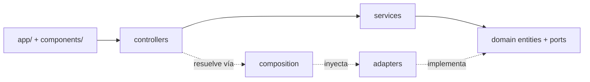

# dashboard-boilerplate

Base white-label de un **dashboard/admin** reutilizable entre proyectos con dominios distintos.
**No es un producto terminado**: es una plantilla de arquitectura pensada para bajo acoplamiento
entre lógica de negocio e infraestructura.

## Stack

- Next.js (App Router) + TypeScript
- pnpm
- Vitest

## Por qué está armado así

La lógica de negocio (`domain/` y `services/`) nunca importa una implementación concreta —
ni Prisma, ni el SDK de un proveedor de email, ni la API de un marketplace puntual.
Solo depende de **interfaces** (a las que llamamos *ports*).
Las implementaciones reales viven en `adapters/` y se conectan a la lógica de negocio
en un único lugar: [`src/composition.ts`](./src/composition.ts).

Esto aplica el **principio de inversión de dependencias**: en vez de que el código de negocio
dependa de detalles concretos de infraestructura, ambos dependen de una abstracción común.
La consecuencia práctica es que se puede cambiar de proveedor, de base de datos, o de
cliente/proyecto **sin tocar los casos de uso**: solo se escribe un adapter nuevo que
implemente el mismo port.



`services/` conoce solo `domain/`. Nunca sabe qué adapter concreto está enchufado del otro
lado del port: eso lo decide `composition.ts`, en un único punto.

## Estructura

```
app/                            # rutas — solo composición de UI, sin lógica de negocio
src/
  domain/
    entities/                   # tipos y reglas puras del negocio
    ports/                      # contratos (Notifier, repositories, …)
  services/                     # casos de uso — inyectan ports, nunca importan adapters
  adapters/
    repositories/               # implementaciones contra TU base de datos (ej. Prisma)
    integrations/<nombre>/      # implementaciones contra APIs de terceros
      client.ts                 # llamadas HTTP crudas
      auth.ts                   # auth/tokens si aplica
      mapper.ts                 # traduce entity <-> formato del tercero
      index.ts                  # exporta la implementación del port
  composition.ts                # único punto que cablea adapter concreto → port
  controllers/                  # input → service → output, sin reglas de negocio
  components/
    ui/                         # piezas de presentación puras (Button, Table, …)
    features/                   # UI de una feature, compuesta de piezas de ui/
  lib/                          # utilidades sin negocio ni I/O externo
tests/<feature>/                # tests de esa feature (lógica + UI juntos)
```

## Reglas de dependencia

| Capa | Puede importar | No puede importar |
|------|----------------|-------------------|
| `domain/` | solo dentro de `domain/` | todo lo demás de `src/` |
| `services/` | `domain/` | `adapters/`, `app/`, Next.js |
| `adapters/*` | `domain/ports` (+ su propia integración) | otras integraciones entre sí |
| `composition.ts` | `domain/ports`, `adapters/` | — (único lugar que ve ambos lados) |
| `controllers/` | `services/`, `composition.ts` | lógica de negocio propia |
| `components/ui/` | nada de dominio/servicios | — (todo entra por props) |
| `components/features/` | `domain/entities` (para tipar) | `services/` directo (pasar por controller/hook) |

Regla de oro: si `services/` importa algo desde `adapters/`, la arquitectura se rompió.

## Ejemplo incluido: notificar usuario

Caso de uso deliberadamente neutro, para probar el desacople sin atarse a un dominio
particular (sirve igual para una alerta de stock, un turno confirmado o una publicación aprobada):

| Pieza | Rol |
|-------|-----|
| `domain/entities/notification.ts` | entidad `Notification` |
| `domain/ports/notifier.ts` | interfaz `Notifier` |
| `services/notifyUser.ts` | caso de uso; recibe el `Notifier` inyectado |
| `adapters/integrations/fake-notifier/` | implementación de prueba (consola/memoria, sin proveedor real) |
| `controllers/notifications/notifyUserController.ts` | orquesta input → use case + port desde composition |
| `tests/notifications/` | test con **mock del port** — sin integración real |

## Cómo arrancar

```bash
pnpm install
pnpm dev     # http://localhost:3000
pnpm test    # Vitest
```

Verificación del entorno:

```bash
# Windows
./init.ps1

# macOS / Linux
./init.sh
```

## Cómo se desarrolla este repo

Se construye con TDD estricto (Red → Green → Refactor), asistido por agentes de IA, con un
**gate humano** antes de pasar de “tests escritos” (`tests_ready`) a “implementación”
(`in_progress` solo con el mensaje `aprobado`).

El detalle de proceso, roles y estado de features está en [`AGENTS.md`](./AGENTS.md),
[`CHECKPOINTS.md`](./CHECKPOINTS.md) y [`docs/tdd.md`](./docs/tdd.md). Es agnóstico al
asistente que uses (Cursor, Claude Code u otro). Las reglas locales de IDE no se versionan
en este repo.

## Documentación

| Doc | Contenido |
|-----|-----------|
| [`docs/architecture.md`](./docs/architecture.md) | Capas, dependencias, Server vs Client Components |
| [`docs/tdd.md`](./docs/tdd.md) | Ciclo Red / Green / Refactor |
| [`docs/conventions.md`](./docs/conventions.md) | Naming e imports |
| [`docs/verification.md`](./docs/verification.md) | Cómo verificar que un cambio cumple la arquitectura |

## Qué sigue

Las features white-label candidatas viven en [`feature_list.json`](./feature_list.json)
(`pending`): theme tokens, shell/nav, access levels. Se debaten y se implementan vía el
proceso TDD, no ad hoc.
